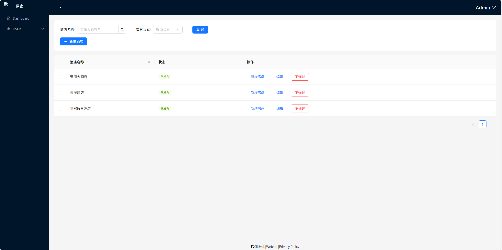
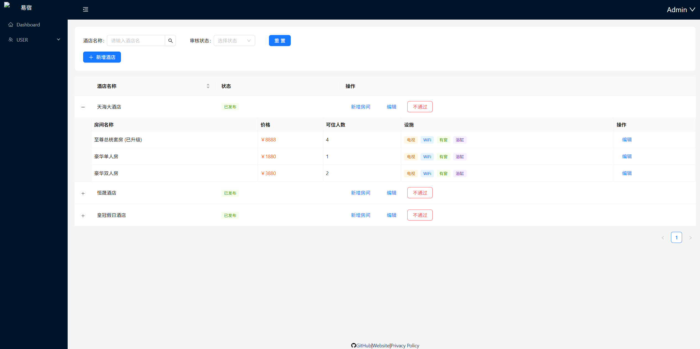
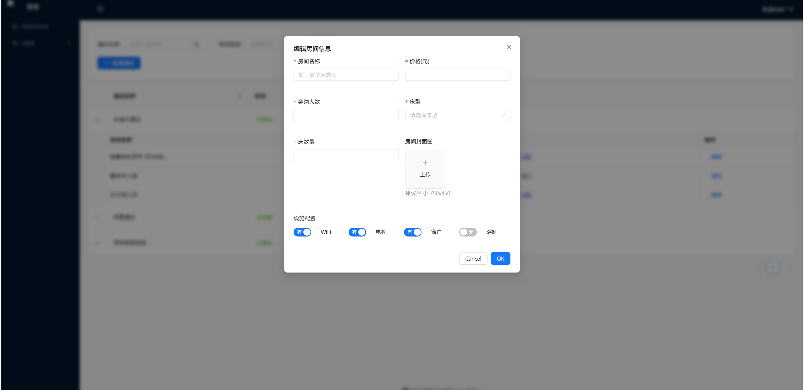

# 🏨 易宿酒店预订管理平台 (Yisu Hotel Platform)

本项目是一个全栈式酒店预订解决方案，模仿“携程”业务逻辑。涵盖了**移动端用户预订流程**、**商户酒店信息管理系统**及**平台管理审核端**。

## 🌟 项目核心亮点
- **多端覆盖**：一套代码支持微信小程序、H5 及 PC 管理后台。
- **全栈开发**：从数据库建模到前端 UI 渲染，打通完整的业务闭环。
- **权限控管**：基于 JWT 的 RBAC（基于角色的访问控制）模型，区分普通用户、商户与管理员。
- **性能优化**：移动端采用虚拟列表渲染长数据，PC 端支持动态路由加载。

---

## 🛠 技术栈
### 前端
- **移动端 (C端)**：`Taro 4.x` + `React` + `NutUI-React` + `SCSS`
- **管理端 (B端/A端)**：`React 18` + `React Router v7` + `Ant Design` + `Vite` + `Axios (请求库)`
- **状态管理**：`Zustand` / `React Hooks`

### 后端
- **服务端**：`Node.js` + `Express`
- **存储**： `阿里云 OSS (对象存储)` —— `用于酒店图片高效托管`
- **数据库**：`MySQL`
- **ORM 框架**：`Prisma v6`
- **认证/安全**：`JSON Web Token (JWT)` + `Bcryptjs`

---

## 📅 功能模块

### 1. 用户预订流程 (移动端/小程序)
- **首页查询**：城市级联选择、入住/离店日期区间选择、关键字搜索。
- **酒店列表**：支持分页、按价格/评分排序、条件筛选。
- **详情展示**：酒店多图轮播、地址导航、实时房型列表及价格展示。

### 2. 酒店信息管理系统 (PC 站点)
- **商户端 (Merchant)**：
  - 用户注册/登录。
  - 酒店基本信息录入（LBS位置、设施、描述）。
  - 房型信息编辑与价格库存维护。
- **平台端 (Admin)**：
  - **审核系统**：商户提交的信息流转至待审队列。
  - **状态管理**：一键发布酒店至移动端，或下线违规酒店。

---

## 📁 项目结构
```text
Yisuo_Hotel_Reservation_Platform/
├── hotel_service/        # 后端 API 服务 (Express + Prisma)
├── hotel_admin/          # PC 管理后台 (React Router v7 + AntD)
└── hotel_mobile/         # 移动端/小程序 (Taro + NutUI)
```

---

## 🚀 快速开始

### 1. 环境准备
- Node.js (v18+)
- MySQL (v8.0+)

### 2. 后端部署
```bash
cd hotel_service
npm install
# 配置 .env 中的 DATABASE_URL
npx prisma generate
npx prisma db push
npm run dev
```

### 3. 移动端启动
```bash
cd hotel_mobile
npm install
npm run dev:weapp # 然后在微信开发者工具导入 dist 目录
```

### 4. 管理端启动
```bash
cd hotel_admin
npm install
npm run dev
```

---

## 📸 项目预览 (部分截图)
> [酒店管理界面]


[新增房间]

---

## 💡 开发心得
- 攻克了 Taro 4 深度嵌套模板在小程序端渲染的性能瓶颈。
- 实现了前后端统一的环境变量管理与 Axios 请求拦截机制。
- 深入实践了 Prisma 关系模型在处理“酒店-房型-订单”复杂关联时的事务处理。

---
---
# 具体框架
## -hotel_admin
需要开发的地方在./app下，界面在view/下
```
├── api/ #调用的api均写在该文件夹下
├── layout/ #布局1
├── layout2/ #布局2
├── types/ #里面的api.ts用来写api返回的数据结构
├── utils/ #里面request.tsx用来拦截api请求
├── views/ #写界面的地方
    ├── login/
    └── register/ 
├── app.css 全局样式
├── routes.ts #写路由的，需要的界面都要写这
```
## -hotel_mobile
开发在./src下，界面在pages下
```
├── api/ #调用的api均写在该文件夹下
├── pages/ #写界面的地方
    ├── list/
    └── detail/ 
├── types/ #里面的api.ts用来写api返回的数据结构
├── utils/ #里面request.tsx用来拦截api请求
├── app.scss 全局样式
├── app.config.ts #写路由的，需要的界面都要写这
├── app.ts #入口，没啥用
```
## hotel_service
开发在./routes和./controllers还有schema.prisma
```
├── config/ #设置
├── controllers/ #写api的一些处理
├── prisma/ 
    └── schema.prisma #写数据库的
├── routes/ #写api的
├── test.http #测试文件
├── app.js #入口
```